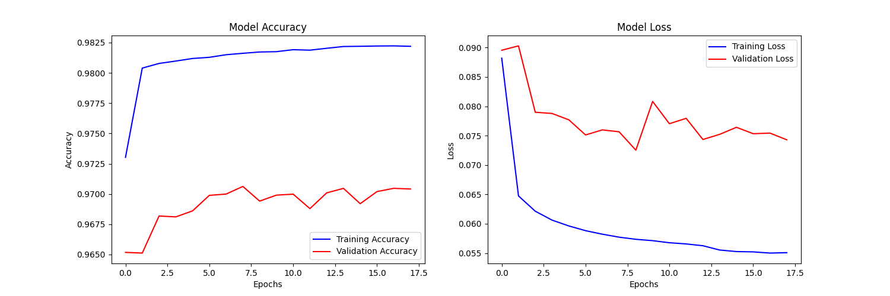

# Prediction Model in GST

## Description

This project involves building a prediction model using GST data. It includes data loading, preprocessing, exploratory data analysis (EDA), and building a Fully Connected Neural Network (FCNN) model using TensorFlow and Keras.

## Table of Contents

- [Installation](#installation)
- [Usage](#usage)
- [Data](#data)
- [Scaling and Rounding](#scaling-and-rounding)
- [Model Training](#model-training)
- [Results](#results)
  - [Model Performance](#model-performance)
  - [Evaluation Metrics](#evaluation-metrics)
  - [Confusion Matrix](#confusion-matrix)
- [Creating Issues](#creating-issues)
- [Contributing](#contributing)
  - [Contribution Guidelines](#contribution-guidelines)
- [License](#license)

---

## Installation

Follow these steps to set up the project locally:

```bash
# Clone the repository
git clone https://github.com/yourusername/yourproject.git

# Navigate to the project directory
cd yourproject

# Create a virtual environment
python -m venv .venv

# Activate the virtual environment

# On Windows
.venv\Scripts\activate

# On macOS/Linux
source .venv/bin/activate

# Install the required packages
pip install numpy tensorflow matplotlib pandas scikit-learn seaborn imblearn

# Unzip the data file
tar -xf data.zip
```

---

## Usage

To run the Jupyter notebook and execute the code:

1. Open the Jupyter notebook `model.ipynb`.
2. Run each cell sequentially to perform data loading, preprocessing, EDA, and model training.

---

## Data

The data used in this project includes:

- `X_Train_Data_Input.csv`: Training data features
- `X_Test_Data_Input.csv`: Test data features
- `Y_Train_Data_Target.csv`: Training data target
- `Y_Test_Data_Target.csv`: Test data target

---

## Scaling and Rounding

The data is scaled using `MinMaxScaler` and rounded to six decimal places for better precision and consistency.

```python
from sklearn.preprocessing import MinMaxScaler
import numpy as np

scaler = MinMaxScaler()
X_train_scaled = scaler.fit_transform(X_train)
X_test_scaled = scaler.transform(X_test)

X_train_rounded = np.round(X_train_scaled, 6)
X_test_rounded = np.round(X_test_scaled, 6)
```

---

## Model Training

The project uses a Fully Connected Neural Network (FCNN) built with TensorFlow and Keras. The model architecture includes dense layers, batch normalization, dropout, and PReLU activation.

```python
from tensorflow.keras.layers import Input, Dense, PReLU, BatchNormalization, Dropout
from tensorflow.keras.models import Model
from tensorflow.keras.optimizers import Adam
from tensorflow.keras.initializers import HeNormal

# Model architecture
input_layer = Input(shape=(X_train.shape[1],))

x = Dense(64, activation=activation, kernel_initializer=initializer)(input_layer)
x = PReLU()(x)
x = BatchNormalization()(x)
x = Dropout(rate)(x)

x = Dense(32, activation=activation, kernel_initializer=initializer)(x)
x = PReLU()(x)
x = BatchNormalization()(x)
x = Dropout(rate)(x)

x = Dense(64, activation=activation, kernel_initializer=initializer)(x)
x = PReLU()(x)
x = BatchNormalization()(x)
x = Dropout(rate)(x)

output_layer = Dense(2, activation='softmax')(x)

model = Model(inputs=input_layer, outputs=output_layer)

model.compile(optimizer=opt, loss=loss, metrics=['accuracy', 'Precision', 'Recall', 'AUC'])
```

---

## Results

### Model Performance

Below is the accuracy graph showing the model's performance over epochs:

```python
# Plotting model accuracy and loss

plt.figure(figsize=(15, 5))

plt.subplot(1, 2, 1)
plt.plot(history.history['accuracy'], label='Training Accuracy', color='blue')
plt.plot(history.history['val_accuracy'], label='Validation Accuracy', color='red')
plt.title('Model Accuracy')
plt.xlabel('Epochs')
plt.ylabel('Accuracy')
plt.legend()

plt.subplot(1, 2, 2)
plt.plot(history.history['loss'], label='Training Loss', color='blue')
plt.plot(history.history['val_loss'], label='Validation Loss', color='red')
plt.title('Model Loss')
plt.xlabel('Epochs')
plt.ylabel('Loss')
plt.legend()

plt.tight_layout()
plt.savefig('model_accuracy_loss.png')
plt.show()
```



### Evaluation Metrics

The final evaluation metrics on the test set are as follows:

- **Accuracy**

  - **Train**: 98%
  - **Test**: 97%

- **Loss**
  - **Train**: 5%
  - **Test**: 7%

---

### Confusion Matrix

Below is the confusion matrix showing the model's performance on the test set:

```python
# Predicting the target variable
Y_pred = model.predict(X_test)

Y_pred = np.argmax(Y_pred, axis=1)

Y_test = np.argmax(Y_test, axis=1)

# Creating a confusion matrix

cm = confusion_matrix(Y_test, Y_pred)

plt.figure(figsize=(10, 5))
sns.heatmap(cm, annot=True, fmt='d', cmap='Blues', xticklabels=['0', '1'], yticklabels=['0', '1'])
plt.title('Confusion Matrix')
plt.xlabel('Predicted')
plt.ylabel('Actual')

plt.savefig(os.path.join(confusion_matrix_path, 'confusion_matrix.png'))

print(f'The confusion matrix has been saved successfully at {confusion_matrix_path}')

plt.show()
```


---

## Creating Issues

If you encounter any bugs or have feature requests, please create an issue in the repository. Please follow these guidelines when submitting an issue:

1. **Search Existing Issues**: Before opening a new issue, check if the issue has already been reported.

2. **Use a Clear Title**: Provide a concise and descriptive title that summarizes the issue.

3. **Provide Detailed Information**:

   - **Description**: Clearly describe the problem or feature request.
   - **Steps to Reproduce**: Include step-by-step instructions to reproduce the issue.
   - **Expected vs. Actual Behavior**: Explain what you expected to happen and what actually happened.
   - **Environment Details**: Mention the version of the software, operating system, and any other relevant details.

4. **Include Supporting Materials**:

   - **Screenshots**: Attach screenshots if they help illustrate the issue.
   - **Logs and Error Messages**: Provide any relevant logs or error messages.

5. **Be Respectful**: Keep the conversation professional and respectful.

---

## Contributing

Contributions are welcome! Please follow the guidelines below to contribute to the project.

### Contribution Guidelines

1. Fork the repository.
2. Create a new branch for your feature or bug fix:

   ```bash
   git checkout -b feature/your-feature-name
   ```

3. Make your changes.
4. Ensure your code follows the project's coding standards.
5. Write tests for your changes, if applicable.
6. Commit your changes with clear and descriptive messages:

   ```bash
   git commit -m "Add feature XYZ"
   ```

7. Push your changes to your forked repository:

   ```bash
   git push origin feature/your-feature-name
   ```

8. Create a pull request with a detailed description of your changes.

---

## License

This project is licensed under the MIT License. See the [LICENSE](LICENSE) file for more details.
